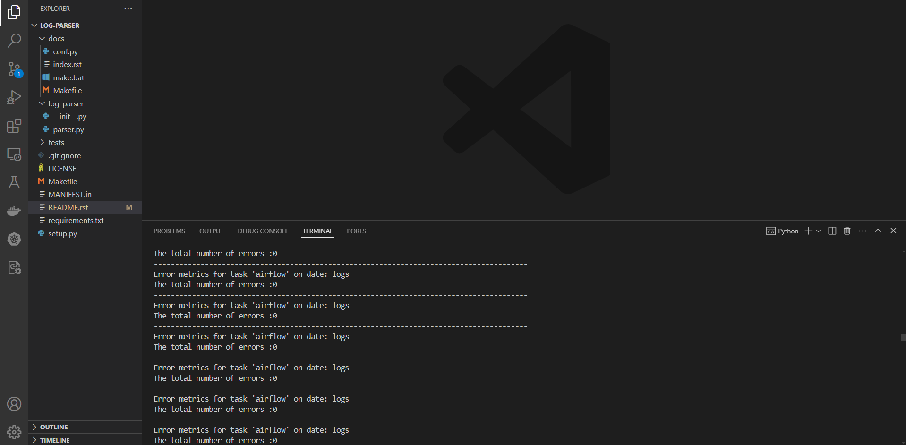

Springboard Mini Project
========================

This simple project is an example for analysizing airflow logs

log analyzer should show the following information:

**1.The total count of error messages**

**2.A detailed message regarding each error**

In this mini-project, we can see

**1.text processing techniques in Python to make sense of logs**

**2.Learn where logs are located in Airflow**

**3.Learn how to monitor automated Airflow DAGs to ensure they are working properly**

The code parses for every line and looks for the word error.

